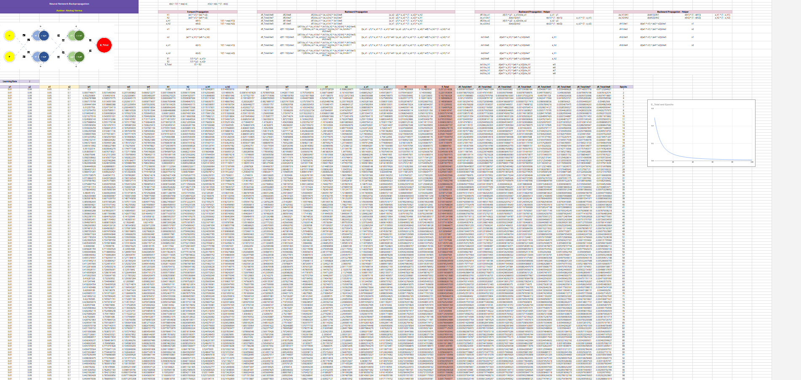
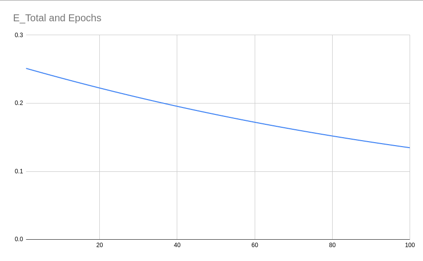
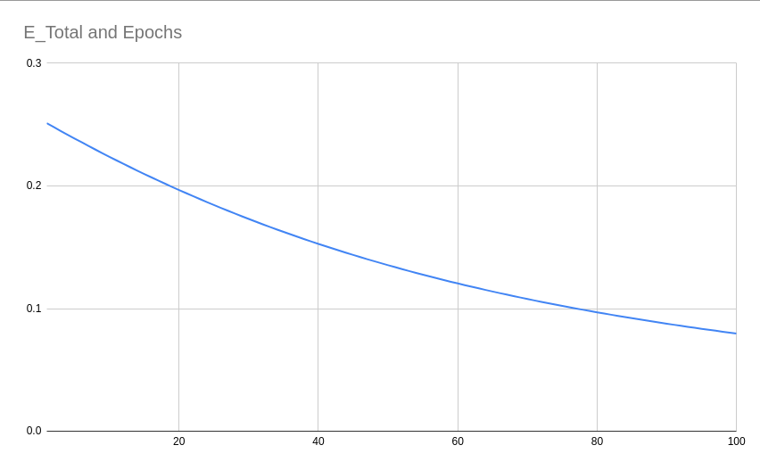
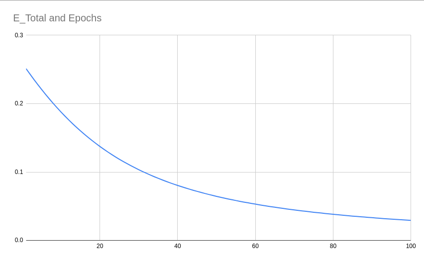
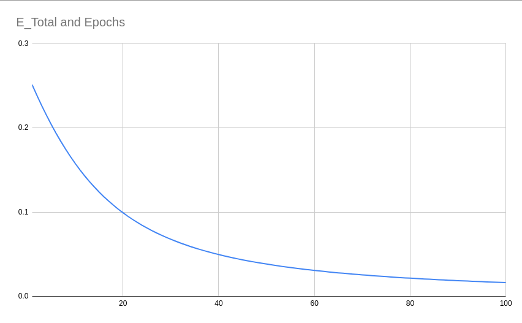
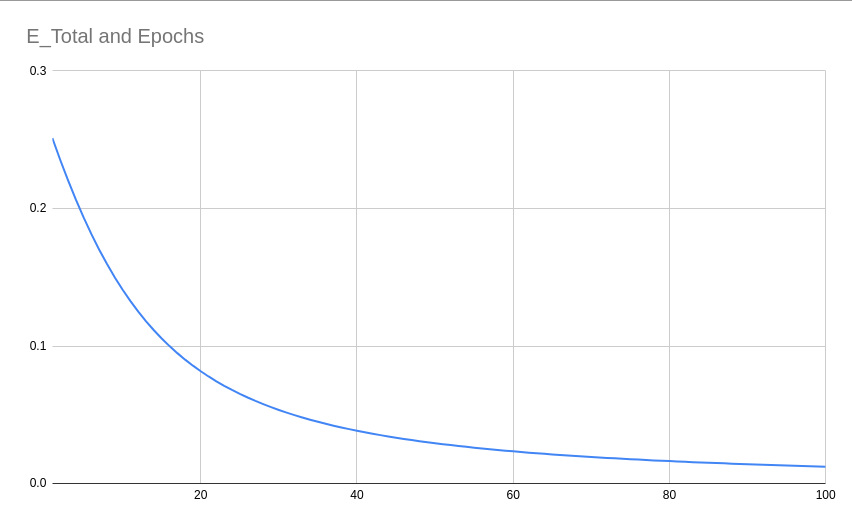
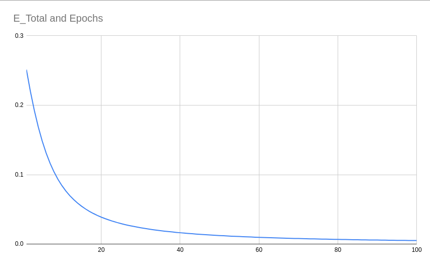
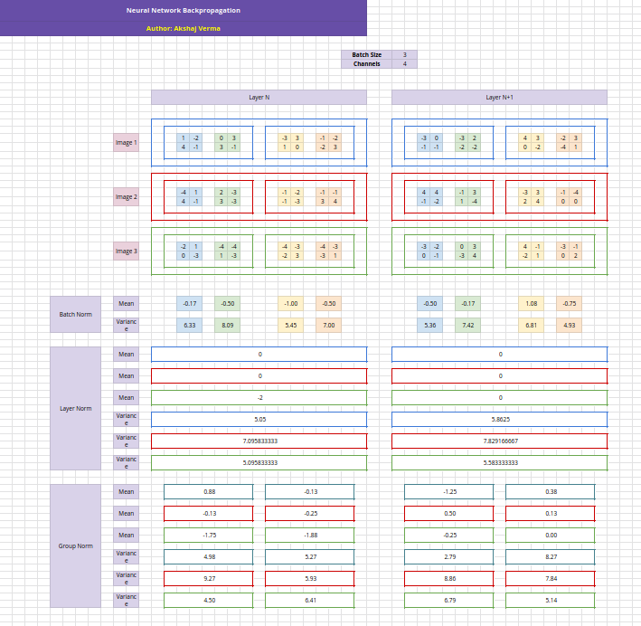
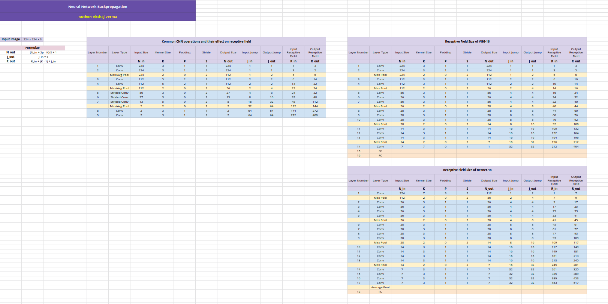

# Deep Learning In The Sheets

A repository of google-sheets that aim to demystify deep learning concepts through visualization.

## Contents

```
1. Backpropagation
2. Normalization
3. Receptive Field Calculation
```

## 01. Backpropagation



You can download the `.xlsx` file from `./01_backpropagation/backpropagation.xlsx` or view the [google sheet](https://docs.google.com/spreadsheets/d/1zfsvxzpdxHdwX4QAY6n6gpKvafgM4mwG-QgZj3uF09U/edit?usp=sharing).

The sheet contains an example to train a deep neural network in excel. There are 2 major parts in it -

1. Forward Propagation
2. Backward Propagation

### Forward Propagation

We have an input of dimensionality 2 which is fed to the network. The inputs are denoted by `x1` and `x2`.

The network consists of an input layer, a hidden layer, and an output layer. Each layer is followed by an activation function to introduce non-linearity into the network.

- Input: `x1, x2`
- output: `y1, y2`
- Weights: `w1, w2, w3, w4, w5, w6, w7, w8`
- Intermediate outputs: `h1, a_h1, o1, o2`
- Final Output: `a_o1, a_o2`
- MSE Loss: `E1, E2`

Although the parameters are initialised randomly, for our exercise we choose the following values.

| w1  | w2  |  w3  | w4  | w5  |  w6  | w7  |  w8  |
| :-: | :-: | :--: | :-: | :-: | :--: | :-: | :--: |
| 0.3 | 0.5 | -0.2 | 0.7 | 0.1 | -0.6 | 0.3 | -0.9 |

The inputs `x1` and `x2` are used to calculate the neuron values of the hidden layer using the following equation.

`h1 = (w1 * x1) + (w2 * x2)`

`h2 = (w3 * x1) + (w4 * x2)`

These outputs are then passed through a sigmoid function.

`a_h1 = σ(h1) = 1/(1 + exp(-h1))`

`a_h2 = σ(h2) = 1/(1 + exp(-h2))`

Once we have the middle neurons, we then calculate the output neurons using the following equations.

`o1 (w5 * a_h1) * (w6 * a_h2)`

`o2 (w7 * a_h1) * (w8 * a_h2)`

Activations of these outputs.

`a_o1 = σ(o1) = 1/(1 + exp(-o1))`

`a_o2 = σ(o2) = 1/(1 + exp(-o2))`

Once we have the output from the network, we calculate the Mean Squared Error loss using our actual outputs.

`E1 = 0.5 * (y1 - a_o1)²`

`E2 = 0.5 * (y2 - a_o2)²`

Finally, we calculate the total loss using which we'll perform backpropagation.

`E_Total E1 + E2`

### Backward Propagation

During backpropagation, we first calculate the derivative of the total error with respect to all the weights using chain rule.

The final equations are:

`∂E_Total/∂w8 = (a_o2 - y2) * a_o2 * (1 - a_o2) * a_h2`

`∂E_Total/∂w7 = (a_o2 - y2) * a_o2 * (1 - a_o2) * a_h1`

`∂E_Total/∂w6 = (a_o1 - y1) * a_o1 * (1 - a_o1) * a_h2`

`∂E_Total/∂w5 = (a_o1 - y1) * a_o1 * (1 - a_o1) * a_h1`

`∂E_Total/∂w4 = [(a_o1 - y1) * a_o1 * (1 - a_o1) * w6 + (a_o2 - y2) * a_o2 * (1 - a_o2) * w8] * a_h2 * (1 - a_h2) * x2`

`∂E_Total/∂w3 = [(a_o1 - y1) * a_o1 * (1 - a_o1) * w6 + (a_o2 - y2) * a_o2 * (1 - a_o2) * w8] * a_h2 * (1 - a_h2) * x1`

`∂E_Total/∂w2 = [(a_o1 - y1) * a_o1 * (1 - a_o1) * w5 + (a_o2 - y2) * a_o2 * (1 - a_o2) * w7] * a_h1 * (1 - a_h1) * x2`

`∂E_Total/∂w1 = [(a_o1 - y1) * a_o1 * (1 - a_o1) * w5 + (a_o2 - y2) * a_o2 * (1 - a_o2) * w7] * a_h1 * (1 - a_h1) * x1`

Once we have the gradients, we update the weights using the following equation.

`w_new = w_old - (LR * ∂E/∂w)`

`LR` is the learning rate which is used to ensure the update step isn't too large. If the LR is too big, the network may not converge at all.

### Learning Rate Experiment

Increasing the learning leads to faster convergence in 100 epochs. The total error reduces quickly for a higher learning rate.

- LR = 0.1
  

- LR = 0.2
  

- LR = 0.5
  

- LR = 0.8
  

- LR = 1.0
  

- LR = 2.0
  

## 02. Norm Calculations in Deep Learning



You can download the `.xlsx` file from `./02_normalization/norm_calc.xlsx` or view the [google sheet](https://docs.google.com/spreadsheets/d/1OJsXJQAmDBcwJIMQ0f07bmqp3Wj9lL8tBwlXZ0vkKDM/edit?usp=sharing).

In this file, we try to visualize the following norms commonly used in deep learning architectures.

1. Batch Normalization
2. Group Normalization
3. Layer Normalization

In batch-norm, we calculate the mean and variance statistics for each channel across a mini-batch. The case is opposite for layer-norm, where we calculate the mean/variance statistics for each batch across the channel. Finally, group-norm is similar to layer-norm except for the fact that we break our channels into groups and calculate the mean/variance statistics for each group separately.

## 03. Receptive Field Calculation



You can download the `.xlsx` file from `./03_receptive_field/receptive_field.xlsx` or view the [google sheet](https://docs.google.com/spreadsheets/d/1C9SaWjEQGumzyb3XqEBo5XmcydNNfWmlmrHPOD2bstc/edit?usp=sharing).

This sheet contains receptive field calculations for a few common operations found in Convolutional Neural Networks along with calculations done for VGG-16 and ResNet-18 networks.
